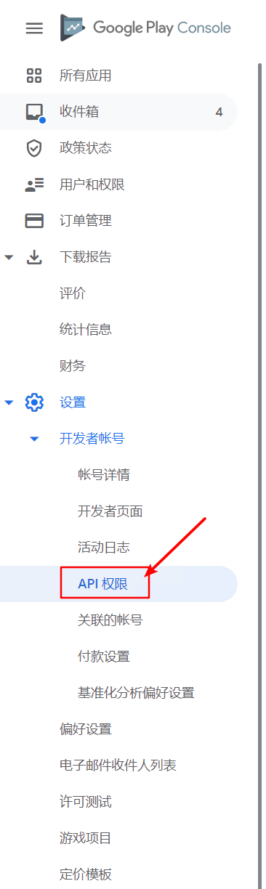
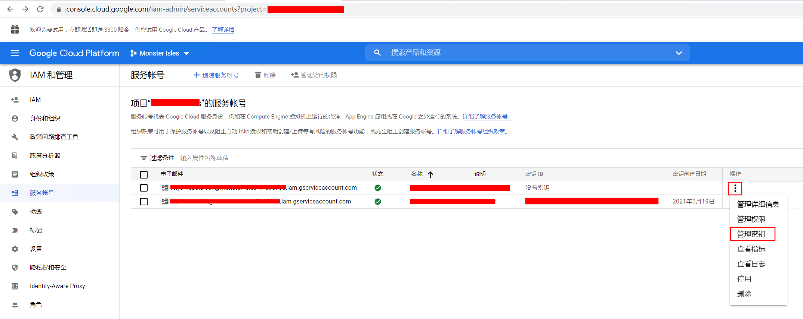
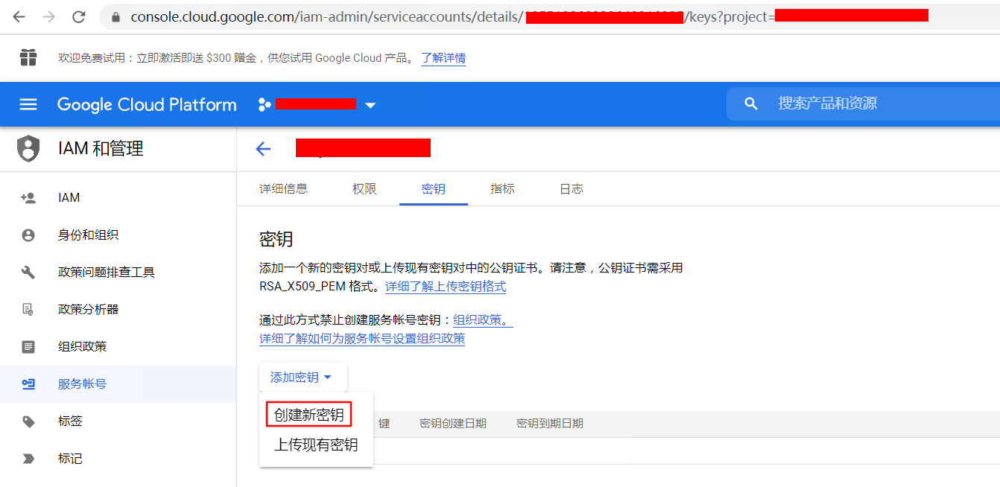
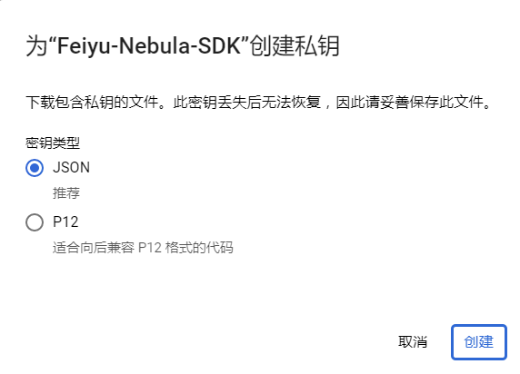

# Google Play上线的游戏，C#服务端如何校验内购订单

## 准备工作

1. 在Google Play Console中启用API权限
2. 在Google Cloud中准备好服务账号
3. 坑：如果游戏内购商品早于服务账号创建，需要修改一下内购商品的信息，更新一下，才能真的获得权限

### 1. 在Google Play Console中启用API权限

打开Google Play Console后台的首页（注意：不是某个游戏管理的首页）。



如果你是第一次打开这个页面，会提示你是否启用。点击启用按钮，会问你是否绑定Google Cloud、Google Developer等等，一路确定就好了。

### 2. 在Google Cloud中准备服务账号

然后点击 `创建新的服务账号`，根据指引进入 Google Cloud 的后台进行创建，名字取好，其他都默认就可以了。

创建完以后，很重要的一步，是要创建密钥。







选择默认的json密钥就可以了。点击创建以后，会自动下载一个json文件。这个json文件待会在代码中会用到。这个文件就是这个账号的密钥了，一定要保存好，因为之后就没有机会让你再下载第二次了。

这个时候返回 Google Play Console 刚刚的页面，刷新一下服务账号，就可以看到刚刚创建的服务账号了。然后根据你自己的需要对这个账号进行授权，就可以了。

### 3. 没有权限的问题解决

如果做完了以上两步，直接进行下面的代码测试，发现返回错误

```
The current user has insufficient permissions to perform the requested operation.
```

那恭喜你，遇到了Google的坑。这是由于你的服务账号创建以及绑定权限晚于内购商品的创建造成的。不过问题也比较容易解决，只要修改一下内购商品的信息，更新一下，就能真的获得权限了。

## 代码以及测试

### API

我先找到了这个API文档，
https://developers.google.com/android-publisher/api-ref/rest/v3/purchases.products

它一上来就告诉我，会返回什么值，但是就是不告诉我怎么发起请求。

<pre code="json">
{
  "kind": string,
  "purchaseTimeMillis": string,
  "purchaseState": integer,
  "consumptionState": integer,
  "developerPayload": string,
  "orderId": string,
  "purchaseType": integer,
  "acknowledgementState": integer,
  "purchaseToken": string,
  "productId": string,
  "quantity": integer,
  "obfuscatedExternalAccountId": string,
  "obfuscatedExternalProfileId": string,
  "regionCode": string
}
</pre>

于是我又找到了Google Api的C#封装：https://github.com/google/google-api-dotnet-client

并且提供了nuget支持：https://www.nuget.org/packages/Google.Apis.AndroidPublisher.v3

那一切就好办了

### 代码

<pre code="chsarp">
private static Task<ProductPurchase> GetInAppPurchase(string packageName, string productId, string purchaseToken)
{
    GoogleCredential credential;
    //这里用到上面准备工作中得到的json
    using (Stream stream = new FileStream(@"api.json", FileMode.Open, FileAccess.Read, FileShare.Read))
    {
        credential = GoogleCredential.FromStream(stream);
    }

    string[] scopes = {
        AndroidPublisherService.Scope.Androidpublisher
    };
    credential = credential.CreateScoped(scopes);

    BaseClientService.Initializer initializer = new BaseClientService.Initializer()
    {
        HttpClientInitializer = credential,
        ApplicationName       = "My Application"
    };
    
    AndroidPublisherService service = new AndroidPublisherService(initializer);
    return service.Purchases.Products.Get(packageName, productId, purchaseToken).ExecuteAsync();
}

private static void TestGooglePlayPurchaseApi()
{
    //以下参数替换为自己项目对应的值
    string packageName = "validPackageName";          //包名
    string productId   = "validOrInvalidProductName"; //内购商品ID
    string purchaseToken = "validPurchaseToken";      //订单的PurchaseToken

    ProductPurchase purchase = GetInAppPurchase(packageName, productId, purchaseToken).Result;

    Console.WriteLine("Kind: " + purchase.Kind);
    Console.WriteLine("Quantity: " + purchase.Quantity);
    Console.WriteLine("AcknowledgementState: " + purchase.AcknowledgementState!);
    Console.WriteLine("ConsumptionState: " + purchase.ConsumptionState!);
    Console.WriteLine("DeveloperPayload: " + purchase.DeveloperPayload);
    Console.WriteLine("ETag: " + purchase.ETag);
    Console.WriteLine("OrderId: " + purchase.OrderId);
    Console.WriteLine("ProductId: " + purchase.ProductId);
    Console.WriteLine("PurchaseState: " + purchase.PurchaseState!);
    Console.WriteLine("PurchaseToken: " + purchase.PurchaseToken);
    Console.WriteLine("PurchaseType: " + purchase.PurchaseType!);
    Console.WriteLine("RegionCode: " + purchase.RegionCode);
    Console.WriteLine("PurchaseTimeMillis: " + purchase.PurchaseTimeMillis);
    Console.WriteLine("ObfuscatedExternalAccountId: " + purchase.ObfuscatedExternalAccountId);
    Console.WriteLine("ObfuscatedExternalProfileId: " + purchase.ObfuscatedExternalProfileId);
}
</pre>

### 测试

包名和商品ID都是固定的，所以我们只要拿到一个 `PurchaseToken` 就可以进行测试了。如果你以为测试一定要集成到app中，才能得到 `PurchaseToken`，那就错了。其实我们在Google Play Console的后台，就能获得这个 `PurchaseToken` 了。打开Console默认页（非单款游戏管理页面），左边的菜单中，有个 `订单管理`，进入 `订单管理`，选择你想测试的游戏的订单，点击箭头，进入订单详情，在详情中，就可以复制 `PurchaseToken` 进行测试了。

## 参考

1. https://stackoverflow.com/questions/64217553/purchases-products-get-is-ignoring-productid-value-and-returns-null-in-productpu
2. https://stackoverflow.com/questions/43536904/google-play-developer-api-the-current-user-has-insufficient-permissions-to-pe